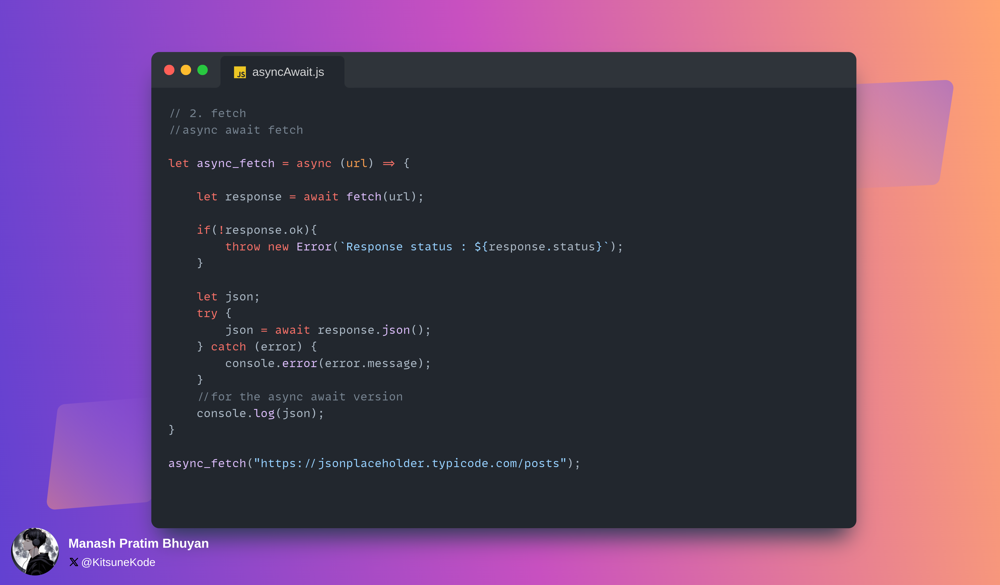

# Assignment Solution

## Description

Contains the promisified version of the fetch, setTimeout, and fs.readFile. 
It also contains the async await version of fetch.

## Images

     
     
     
     
     
     

